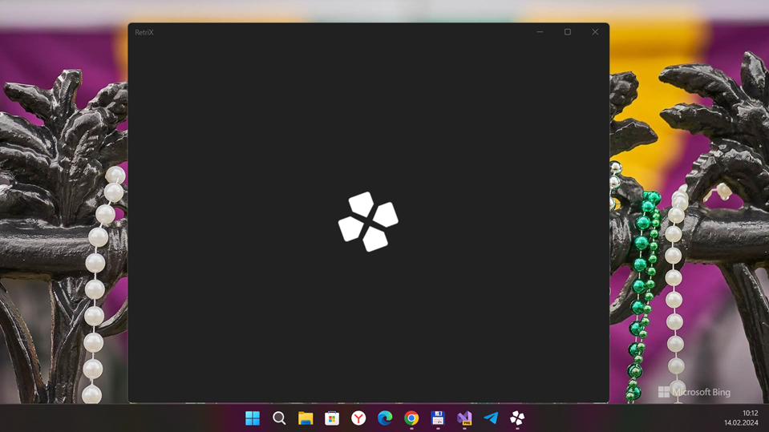
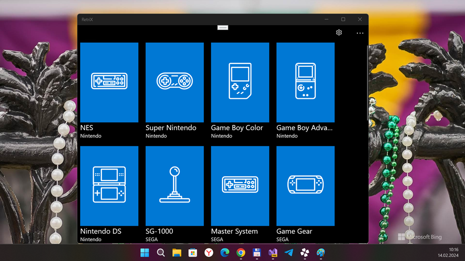
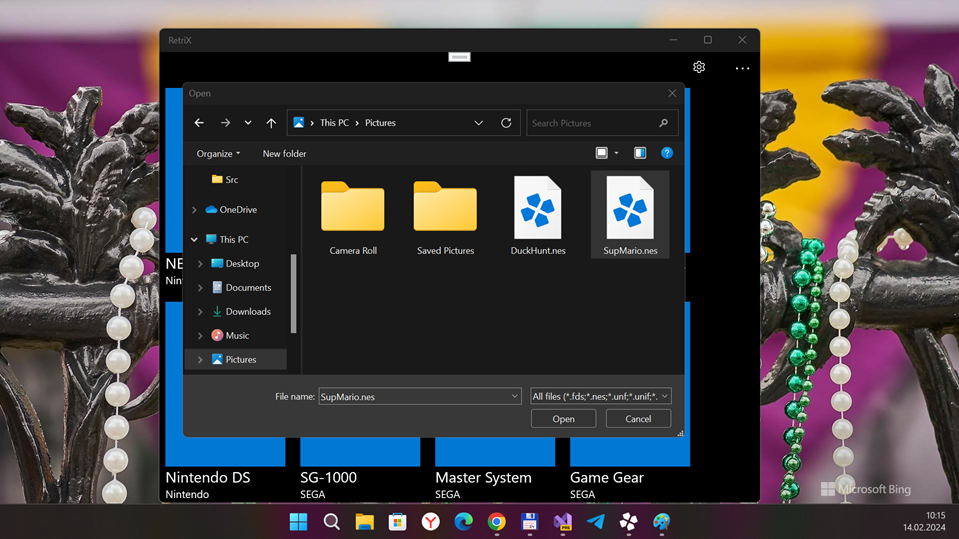
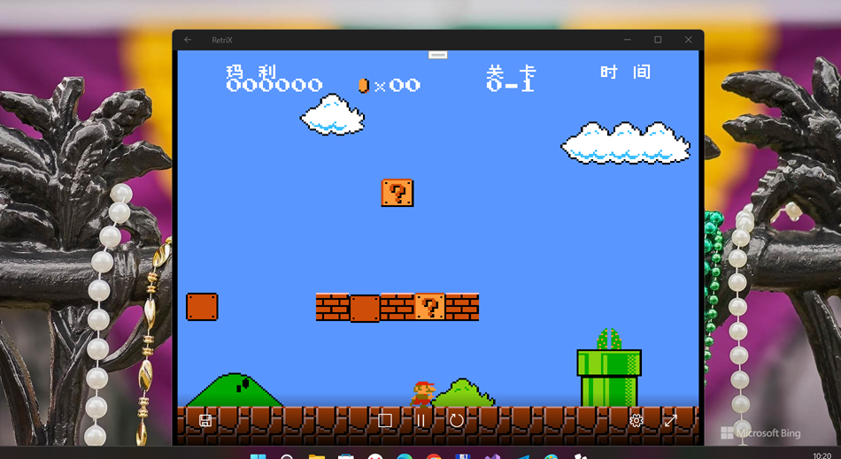
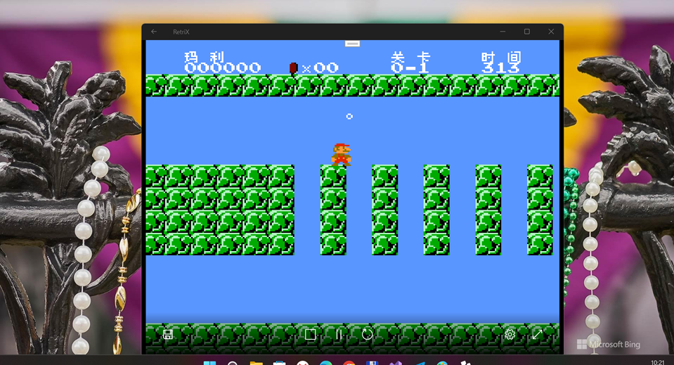
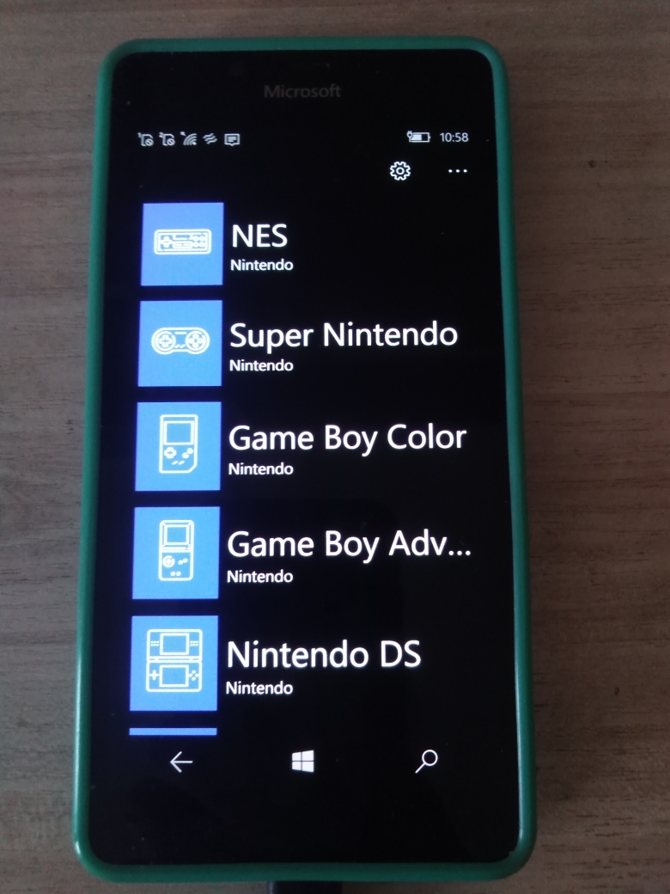
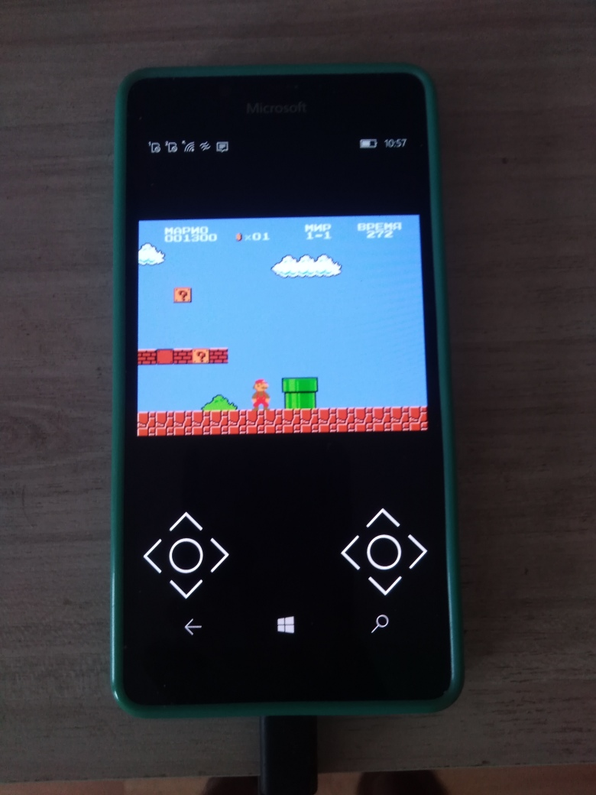
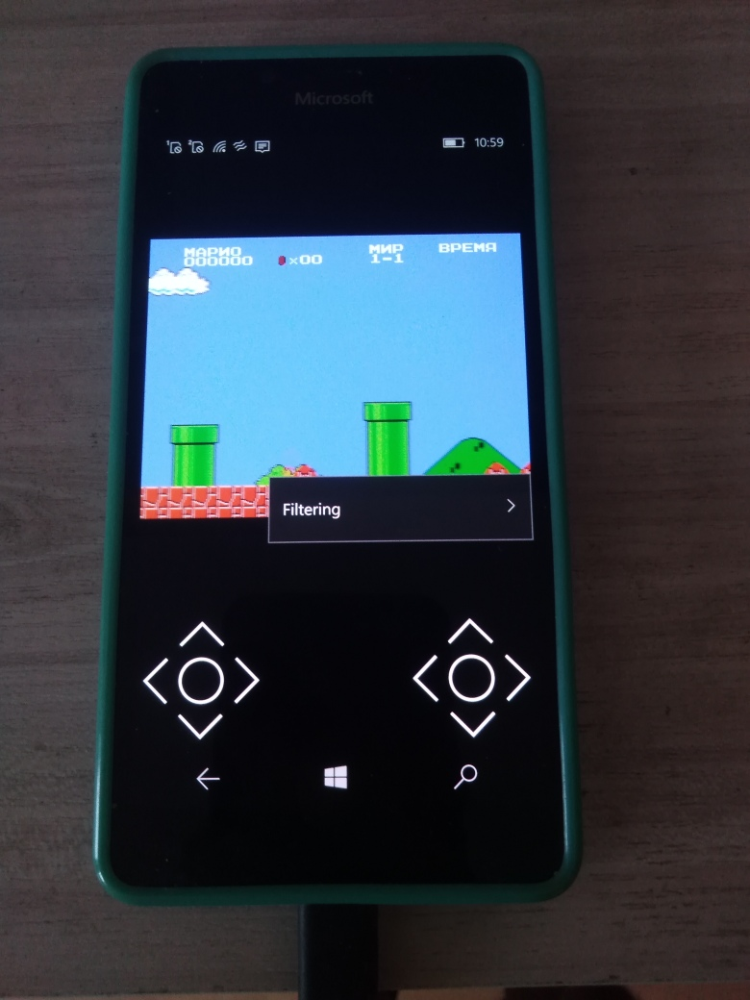
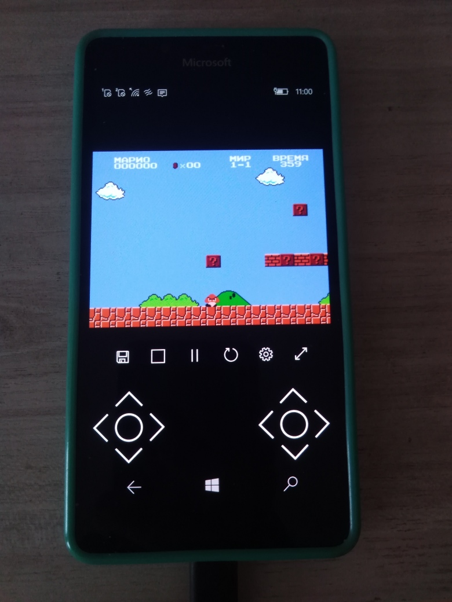

# RetriX v2.0.2a (pre-alpha; UWP edition; "RetriX Lite" codename) 

Planned as lite version of RetriX project (only "NES" core... and, maybe, Android target support... idk yet). Draft. Not for production. My Retrix "code archive".... no more, no less!

## About (a few words of author)

"RetriX is an emulator front end for UWP, on all the hardware platforms it supports: it serves the same purpose as RetroArch but is built from the ground up to integrate as well as possible with Windows.
It can run on desktop, tablet, phone and Xbox One (in dev mode). Holographic, Mixed Reality and Continuum on phone should work too but haven't beed tested." - Alberto Fustinoni

## Notice 
*This is no longer maintained, purely uploaded and made public for those who are curious or wish to try fix any issues. Expect no (or minimal) future updates to this repo*. 
Amd, this version of Retrix has known bug: VM don't want to stop / restart / recover after any attemptx to exit... Only mobile device switch off & on can help ... 

## My photos (desktop build for test / debug deals)

## Tech. details
- My fork based on very old Retrix commit. I made minimal code changes. In theory, W10M compatibility still present...
- Target: x64 (but ARM included too, for future purposes)
- Win. OS build: 19041 (or 18xxx) and above
- Minimal Win. OS build: 14393

## Status
- [+] App / Machine load
- [+] NES emu
- [?] Super NES emu
- [-] Virtual gamepad

## To-Do
- RnD LibretroRT. Reduce supported cores' count to 2 or even 1 (for example, "NES").
- Research multi-platform deals (as I know, old MVVMCross.Core 5.3 don't like XF's Android and iOS...)
- Add onscreen (virtual) keys control..
- Add mouse support (?)
- Fix reset/pause/stop deals
- Fix settings menu
- Find better way to improve overall emu speed... i.e. more C++ needed ;)

## Credits
* Original Retrix UWP developer:

- [Alberto Fustinoni](https://github.com/albertofustinoni)

* Retri UWP port re-development / improvements:

- [Bashar Astifan](https://github.com/basharast)  (RetrixGold Project)
- [Empyreal96](https://github.com/Empyreal96)     (x86Emulator Project) 

## ..
AS is. (For) my own small and poor RnD only. Just for fun :)

## .
- [M]edia[E]xplorer 2024

